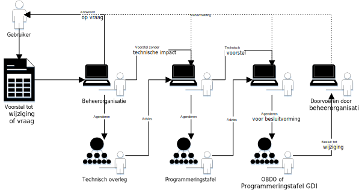

# Technisch overleg

# Agenda

|  |   |
|------------------------|-------------------------------------|
| Betreft  | **Technisch Overleg Digikoppeling** |
| Vergaderdatum en -tijd | 24-03-2022 - 13:30 uur  |
| Vergaderplaats  | Webex  |
  
## Onderwerpen

| Tijd | Onderwerp | 
| --- | --- | 
| 13:30-13:35 | Welkom & Mededelingen |     
| 13:35-13:40 | Verslag vorig TO:  [Verslag TO Digikoppeling 02-12-2021](https://github.com/Logius-standaarden/Overleg/blob/main/Digikoppeling/2021-12-02/211202_Verslag_Technisch_Overleg%20Digikoppeling.md) |   
| 13:40-13:50 | Beheer  [Toelichting: hoe beheren we issues en wijzigingsvoorstellen](#toelichting-hoe-beheren-we-issues-en-wijzigingsvoorstellen)    | 
| 13:50-14:10 | Goedkeuren Releaseplan      [Toelichting komende release](#toelichting-komende-release)  _[Goedkeuring door TO]_ 
| 14:10-14:15 | Roadmap : Vaststellen definitieve versie  zie [Roadmap Digikoppeling](#definitieve-roadmap)  _[Goedkeuring door TO]_|     
| 14:15-14:45 | Roadmap : [Stand van zaken Roadmap onderdelen](#stvz-lopende-roadmap-items) |     
| 14:45-15:00 | Rondvraag & Afsluiting. |     

# Wijzigingen

## Grote wijzigingen
* Digikoppeling-Beheermodel [issue #3] [Aanpassing beheermodel op MIDO governance](https://github.com/Logius-standaarden/Digikoppeling-Beheermodel/issues/3) (16 Mar. 2022), _Status: In bewerking_
* Digikoppeling-Koppelvlakstandaard-ebMS2 [issue #6] [Digikoppeling baseren op ebMS3](https://github.com/Logius-standaarden/Digikoppeling-Koppelvlakstandaard-ebMS2/issues/6) (03 Feb. 2022), _Status: In onderzoek_
* Digikoppeling-Algemeen [issue #1] [Toevoegen Rest API profiel](https://github.com/Logius-standaarden/Digikoppeling-Algemeen/issues/1) (01 Feb. 2022), _Status: Klaar voor release_

## Kleine wijzigingen
* OIN-Stelsel [issue #5] [Kvk nummer leidend voor OIN  ](https://github.com/Logius-standaarden/OIN-Stelsel/issues/5) (29 Mar. 2022), _Status: In onderzoek_
* Digikoppeling-Identificatie-en-Authenticatie [issue #4] [Correctie samenvatting](https://github.com/Logius-standaarden/Digikoppeling-Identificatie-en-Authenticatie/issues/4) (21 Feb. 2022)
* Digikoppeling-Algemeen [issue #2] [Aanpassen Bijlage OIN Tabel](https://github.com/Logius-standaarden/Digikoppeling-Algemeen/issues/2) (26 Jan. 2022), _Status: Klaar voor release_

# Toelichting

## Toelichting: hoe beheren we issues en wijzigingsvoorstellen

In het kader van de nieuwe governance willen we het proces van wijzigingsvoorstellen standaardiseren. We accepteren wijzigingsverzoeken als git issues. We labellen issues om scope, status en te agenderen overleg aan te geven. Bovenstaande lijst zijn issues gelabelled voor het Technisch Overleg. Issues worden gegroepeerd naar scope. De lijst is automatisch gemaakt aan de hand van de labels.

We vragen het Technische Overleg advies of goedkeuring op de wijzigingsvoorstellen afhankelijk van de status.

## Toelichting komende release

Als toevoegen van de REST API koppelvlakspecificatie formeel is goedgekeurd door het OBDO kunnen we een release uitbrengen. Behandeling door het OBDO is geagendeerd voor 7 april 2022. Zie ook [Update Digikoppeling REST API Koppelvlak](https://digistandaarden.pleio.nl/groups/view/41aa788c-cd67-4b27-9154-373e9a83dd40/digikoppeling-community/discussion/view/6c1734c0-4f2c-499a-9b92-145f6392e2c9/update-uitbreiding-van-de-digikoppeling-standaard-met-het-rest-api-koppelvlak)

Opgenomen in de release worden:

* [Digikoppeling Architectuur 2.0](https://publicatie.centrumvoorstandaarden.nl/dk/architectuur/2.0vv/)
* [Digikoppeling - Koppelvlakspecificatie REST API 1.0](https://publicatie.centrumvoorstandaarden.nl/dk/restapi/)

De uitbreiding van Digikoppeling met het REST API koppelvlak is doorgevoerd in de Digikoppeling documentatie.
Naast het toevoegen van de REST API koppelvlakspecificatie en het aanpassen van het architectuurdocument nav deze toevoeging zijn ook waar nodig de overige documenten tekstueel aangepast voor de toevoeging van deze nieuwe koppelvlakspecificatie.
Zie hiervoor : 
* [Overzicht Wijzigingsvoorstellen en aanpassingen](Overzicht_wijzgingen.md).
* [Overzicht documenten komende release](https://logius-standaarden.github.io/Publicatie-Preview/Digikoppeling-Overzicht-Actuele-Documentatie-en-Compliance/Toevoegen_Rest_Api/#wat-zijn-de-huidige-versies-van-documenten).

### Verzoek aan het TO:
__Het TO wordt gevraagd om goedkeuring te verlenen aan het opnemen van deze wijzigingen in de komende release van Digikoppeling__

## Definitieve Roadmap

De concept roadmap is in het vorige overleg besproken en goedgekeurd.
Zie [Roadmap Digikoppeling](https://github.com/Logius-standaarden/Digikoppeling-Algemeen/blob/main/Digikoppeling_Roadmap_2022_2023.md)

#### Verzoek aan het TO:
__Het TO wordt gevraagd om de roadmap vast te stellen__

## StvZ lopende roadmap items

### Digikoppeling governance

Zie voorstel in [grote wijzigingen](#Grote-wijzigingen). [Schema beheerproces](Beheerproces.svg)

### Informatievoorziening

We streven naar een vereenvoudiging van onze informatievoorziening. 
* we willen https://publicatie.centrumvoorstandaarden.nl/ uitfaseren en overgaan naar https://gitdocumentatie.logius.nl/
* publicatie van agenda's via github

[Overzicht publicatiesites](Publicatie.png)

### Signing & Encryptie toevoegen aan RESTful API profiel

Onderzoek loopt in samenwerking met KP API werkgroep beveiliging

### Identificatie en Routering

Handreiking voor ondersteuning voor dit onderwerp is in ontwikkeling

### Interoperabiliteit platformen WUS bij gebruik MTOM in combinatie met WS-Security (signing)

Voorbeeld berichten van datapower zijn onderzocht. Aanpassingen op de WUS standaard om de interoperabiliteit te vergroten zouden grote impact hebben op bestaande implementaties die gebruik maken van andere platformen;

### StvZ Respec

Het [ReSpec-profiel](https://github.com/Logius-standaarden/respec) is stabiel en in gebruik in alle Digikoppeling-documenten. De wens is het profiel meer modulair op te zetten om onderhoud te vergemakkelijken en gebruik buiten Logius te faciliteren.

### Verkennen mogelijk gebruik ebMS3/AS4

Zie voorstel in [grote wijzigingen](#Grote-wijzigingen).

