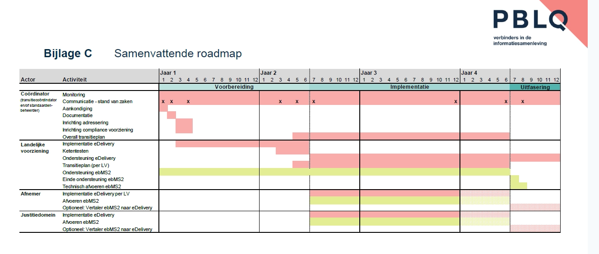

# 1       Toekomstvisie Digikoppeling 

In dit hoofdstuk wordt de toekomstvisie  beknopt weergegeven , in hoofdstuk 2 en in de bijlagen worden onderdelen nader toegelicht.

## 1.1     Huidig Toepassingsgebied Digikoppeling

_Toepassingsgebied Digikoppeling Forum Standaardisatie : Digikoppeling moet worden toegepast bij digitale gegevensuitwisseling die plaatsvindt met voorzieningen die onderdeel zijn van de GDI, waaronder de basisregistraties, of die sectoroverstijgend is. De verplichting geldt voor gegevensuitwisseling tussen systemen waarbij er noodzaak is voor tweezijdige authenticatie._

## 1.2     Scope en Koppelvlakken

| Onderdeel | Nu (van) | Toekomst (naar) | Opmerking |
| --- | --- | --- | --- |
| __Scope__ | G2G - Overheid naar Overheid | G2G - Overheid naar Overheid   B2G - Bedrijven naar Overheid | Uitbreiding van scope naar B2G is onderwerp voor onderzoek en bespreking in het TO Digikoppeling |
| __Koppelvlakstandaarden__: | REST-API (met FSC) | REST-API (met FSC) | Het koppelvlak zal inhoudelijk niet veranderen. De ADR signing en encryptie modulen zijn nu onderdeel van het koppelvlak, maar zullen bij het TO ADR worden behandeld ter mogelijke vaststelling. Aangezien (bij goedkeuring) dan alle API’s die signing en/of encryptie gebruiken hieraan moeten voldoen, zal Digikoppeling naar de vastgestelde ADR modulen verwijzen, in plaats van onderdeel zijn van het koppelvlak. Hiermee wordt dit koppelvlak meer een profiel op de ADR + modulen. |
|  | ebMS2 | uitgefaseerd | ebMS2 wordt uitgefaseerd in het kader van Life cycle management |
|  |  | eDelivery (ebMS3/AS4) | ebMS3/AS wordt opgenomen in Digikoppeling  (Zie onderstaande toelichting) |
|  | WUS | uitgefaseerd | WUS wordt uitgefaseerd in het kader van Life cycle management |
|  | Grote Berichten (GB) | uitgefaseerd    Grote Berichten (als ADR Module) | De grote berichten standaard wordt meer in lijn gebracht met gebruik in REST-API context, ebMS3/AS4  heeft standaard bepaalde ondersteuning voor grote berichten |
|  | - | GraphQL | Onderzocht zal worden of GraphQL kan worden toegevoegd aan Digikoppeling |

## 1.3     Rationale

### 1.3.1    Scope

Koppelvlakken voor Gegevensuitwisseling op het vlak van Overheid naar Bedrijfsleven zijn nog niet gestandaardiseerd. Het standaardiseren en uniformeren van de koppelvlakken tussen Bedrijfsleven en Overheid levert aanzienlijke kostenbesparingen op voor het bedrijfsleven (immers er is dan maar 1 techniek te gebruiken en te onderhouden voor uitwisselingen met de overheid);  Vanuit Beheer en Technisch Overleg willen we daarom de scope van Digikoppeling verbreden naar Overheid ↔ Bedrijfsleven en ook hier koppelvlakken voor te definiëren ; Dit willen we met name verder onderzoeken in 2026 Q1-Q2.

### 1.3.2    Koppelvlakstandaarden

*   REST-API Koppelvlakstandaard (met FSC) is de meest recente toevoeging aan Digikoppeling; 
*   WUS en ebMS2 zijn gebaseerd op standaarden die niet meer actief worden doorontwikkeld en deze standaarden kennen ook een teruglopende ondersteuning vanuit de markt. Deze worden daarom in het kader van Life Cycle Management uitgefaseerd en ebMS3/AS (eDelivery) wordt toegevoegd aan de standaard (zie ook de bijlage voor een nadere toelichting); _De uitfasering van ebMS2 geeft organisaties de mogelijkheid om over te gaan op gebruik van REST-API of op ebMS3/AS (eDelivery) afhankelijk van wat passend is voor de specifieke toepassing_;
*   De Grote Berichten standaard is bedoeld om in combinatie te gebruiken met de andere standaarden wanneer het gaat om overdracht van grote bestanden. Omdat ebMS3/AS4 een eigen functionaliteit heeft voor grote berichten zal in de toekomst alleen behoefte zijn aan afspraken in de context van REST-API's; Daarom kan naar verwachting de grote berichten standaard doorontwikkeld worden in deze richting, of te zijner tijd worden uitgefaseerd als deze functionaliteit in de context van de API-Design-Rules (ADR) wordt ontwikkeld; (Dit zal in 2026 verder worden onderzocht);

## 1.4     Welke standaard wanneer te gebruiken 

Digikoppeling REST-API  is de aanbevolen standaard voor gegevensuitwisseling; ebMS3/AS4 kan worden gebruikt waar dit specifieke voordelen heeft.

Toelichting:

*   REST-API :  m.n. geschikt voor synchrone uitwisseling met een resource oriëntatie  (uitgebreidere inzet is mogelijk  (en toegestaan) maar vraagt  (nu nog) van partijen eigen invulling)
*   eDelivery ebMS3/AS4:  m.n. geschikt voor synchrone  en a-synchrone uitwisseling met een service / bericht oriëntatie  

# 2       eDelivery (ebMS3/AS4)  of REST-API als opvolger van ebMS2 binnen Digikoppeling

## 2.1     Toepassingsgebied Digikoppeling

_Digikoppeling moet worden toegepast bij digitale gegevensuitwisseling die plaatsvindt met voorzieningen die onderdeel zijn van de GDI, waaronder de basisregistraties, of die sectoroverstijgend is. De verplichting geldt voor gegevensuitwisseling tussen systemen waarbij er noodzaak is voor tweezijdige authenticatie._

_Geautomatiseerde gegevensuitwisseling tussen informatiesystemen op basis van NEN3610 is uitgesloten van het functioneel toepassingsgebied._

## 2.2     Uitgangspunten

In [MIDO Domeinarchitectuur Gegevensuitwisseling](https://github.com/MinBZK/gdi-gegevensuitwisseling/blob/master/docs/2.0.3/Domeinarchitectuur%20Gegevensuitwisseling%202.0.3.pdf) worden vormen van Gegevensuitwisseling beschreven:

  
De Digikoppeling koppelvlak standaard(en) moeten in ieder geval deze vormen/perspectieven op gegevensuitwisseling ondersteunen:

- Service-oriëntatie:  Bij Service-oriëntatie (ook wel: Service Oriented Architecture - SOA) bieden applicaties hun functionaliteit aan in de vorm van services. Een applicatieservice is een logisch afgebakend stuk functionaliteit waarmee een bedrijfsfunctie ondersteund wordt. Het is te zien als een doorontwikkeling van wat eerder Remote Procedure Calls werden genoemd.

- Resource-oriëntatie: Bij resource-oriëntatie ligt de nadruk niet op de service maar op de te benaderen resource (bijvoorbeeld een klantobject). Elke resource heeft daartoe een eigen adres (URL) en kent standaard operaties voor het creëren, lezen, wijzigen en verwijderen van gegevens.

- Berichtoriëntatie: Bij berichtoriëntatie staat het bericht centraal, die typisch ook asynchroon wordt gecommuniceerd. Dat betekent dat de zender niet wacht op een antwoord. Vaak gaat het om verwerkingen die uitgesteld verwerkt kunnen worden, zoals periodieke batchprocessen. De nadruk ligt dan vooral op het asynchroon en betrouwbaar verzenden van berichten met Message Oriented Middleware.

Voor overzicht huidige uitgangspunten voor Digikoppeling zie :  [Digikoppeling Architectuur 2.1.0](https://gitdocumentatie.logius.nl/publicatie/dk/architectuur/#uitgangspunten)

## 2.3     Optie 1 REST-API als opvolger van ebMS2 binnen Digikoppeling

Bij deze optie worden alle hierboven genoemde vormen van gegevensuitwisseling ingevuld met REST-API verwante technieken;

**Voordelen:**

1. Een enkele soort techniek en 1 type koppelvlakstandaard voor alle uitwisselingen binnen de Digitale Overheid / GDI
2. Goede ondersteuning vanuit markt
3. Expertise ruim beschikbaar

**Nadelen:**

1. Bericht orientatie /  messaging perspectief is niet gestandaardiseerd (bv adresserings meta data)
2. Asynchroon verkeer is niet gestandaardiseerd 
3. Betrouwbare aflevering is niet gestandaardiseerd

Dus juist bij scenario's waar deze onderwerpen spelen zouden partijen bij deze keuze nog veel zelf moeten invullen, met daarbij ook risico op bepaalde wildgroei van soorten oplossingen;

## 2.4     Optie 2 eDelivery (ebMS3/AS4)  als opvolger van ebMS2 binnen Digikoppeling 

Bij deze optie worden alle hierboven genoemde vormen van gegevensuitwisseling ingevuld met eDelivery (ebMS3/AS4);

**Voordelen:**

1. Vanuit de opzet bedoeld voor Bericht georiënteerde uitwisseling met ondersteuning van asynchroon verkeer en betrouwbare aflevering
2. Vanuit de EU ondersteunde standaard (vanuit opzet bedoeld voor grensoverschrijdend verkeer)

**Nadelen:**

1. Bij deze keuze zijn er 2 koppelvlakken naast elkaar REST-API en ebMS3/AS4 beschikbaar, dit vraagt ook expertise bij partijen van beide technieken;
2. Relatief zwaar voor eenvoudige uitwisselingen
3. SOAP/XML gebaseerd, minder  ondersteuning vanuit Markt,  Expertise minder beschikbaar
4. Op de Europese standaard hebben we vanuit NL minder invloed, wijzigingstrajecten duren mogelijk langer;

## 2.5     Vergelijking

Indicatie mate van ondersteuning in de (huidige versie) van de standaard

### 2.5.1    Vormen van Gegevensuitwisseling

|  | REST_API | eDelivery (ebMS3/AS4) |
| --- | --- | --- |
| Bericht Oriëntatie / Messaging | - | +++ |
| Resource Oriëntatie | +++ | + |
| Service Oriëntatie | - | +++ |

### 2.5.2    Functionele eigenschappen

|  | REST_API | eDelivery (ebMS3/AS4) |
| --- | --- | --- |
| synchrone uitwisseling | +++ | +++ |
| a-synchrone uitwisseling | + | +++ |
| betrouwbare aflevering | + | +++ |
| signing & encryptie | +++ | +++ |

### 2.5.3    Beschikbaarheid Ondersteuning en Expertise

|  | REST_API | eDelivery (ebMS3/AS4) |
| --- | --- | --- |
| Ondersteuning vanuit markt | +++ | ++ |
| Beschikbaarheid expertise | +++ | + |

## 2.6     Conclusie

Op dit moment vult eDelivery ebMS3/AS4 een aantal zaken in die in het REST-API koppelvlak nog niet beschikbaar zijn. vanuit deze optiek is eDelivery ebMS3/AS4 functioneel gezien een waardevolle aanvulling voor de Digikoppeling standaard; Echter de verwachting is dat op termijn REST-API ook de specifieke functionaliteit van ebMS3/AS4 zal bieden waardoor de standaarden dichter bij elkaar komen te liggen; 

**Middellange termijn (2-5 jaar):**

*   REST-API :  m.n. geschikt voor synchrone uitwisseling met een resource oriëntatie  (uitgebreidere inzet is mogelijk  (en toegestaan) maar vraagt  (nu nog) van partijen eigen invulling)
*   eDelivery ebMS3/AS4:  m.n. geschikt voor synchrone  en a-synchrone uitwisseling met een service / bericht oriëntatie ;  

**Lange termijn (5-10 jaar):**

Functionaliteit  van REST\_API koppelvlak zal dichter bij  de functionaliteit van ebMS3/AS4 komen te liggen, waardoor de mogelijkheid voor partijen om te standaardiseren op het REST-API koppelvlak  toeneemt

**Samenvattend:**

Vanuit het "Digikoppeling als gereedschapskist voor Gegevensuitwisseling"  perspectief is opname van eDelivery (ebMS3/AS4) als opvolger van ebMS2 binnen Digikoppeling mogelijk, visie is dan dat partijen kiezen welke standaard zij in een bepaalde situatie inzetten, maar vanuit Digikoppeling zijn er dan standaarden beschikbaar met voldoende ondersteuning;  
Voor inzet van eDelivery zijn centrale SMP/SML voorzieningen wenselijk/nodig voor de 'adres boek' functionaliteit;

Een alternatief zou zijn om de uitfasering van ebMS2 aan te grijpen voor een volledige REST-API first & only benadering, In dit geval wordt eDelivery (ebMS3/AS4) niet toegevoegd aan Digikoppeling maar wordt de REST-API koppelvlakstandaard uitgebreid met de ontbrekende ondersteuning voor asynchroon verkeer , betrouwbare aflevering en ook bericht / service oriëntatie;  (technieken hiervoor zijn beschikbaar, deze zijn alleen nog niet gestandaardiseerd)

Gezien de verwachte doorlooptijd van verdere standaardisatie (rond REST-API) is het wenselijk om Delivery ebMS3/AS4 in ieder geval aan te bieden als optie binnen de Digikoppeling standaard voor de middellange termijn;

# 3 Bijlage  Technisch Overleg Digikoppeling:

## 3.1     2025-03-19 Technisch Overleg

- [2025-03-18\_Visievorming - TO DigiKoppeling.pptx](https://logius-prd.confluence.odc-noord.nl/download/attachments/367002287/2025-03-18_Visievorming%20-%20TO%20DigiKoppeling.pptx?api=v2&modificationDate=1743414900970&version=1) > Presentatie op TO 19-mrt-2025 

- [Polls-per-participant-2025-03-25\_Technische\_Overleg\_DigiKoppeling\_-\_Toek.xlsx](https://logius-prd.confluence.odc-noord.nl/download/attachments/367002287/Polls-per-participant-2025-03-25_Technische_Overleg_DigiKoppeling_-_Toek.xlsx?api=v2&modificationDate=1743415058343&version=1) > Slido resultaten TO 19-mrt-2025 

Samenvatting Sessie Toekomstvisie/Enquete TO Digikoppeling 2025-03-18

*   Welke standaarden ontbreken er nu nog binnen DigiKoppeling en zouden we moeten Toevoegen?

    - **1 Graphql**
    - **2 Asyncapi**
    - **3 ebMS3/AS4**

*   Welke standaarden binnen DigiKoppeling zouden uitgefaseerd mogen worden?

    - **ebMS2**
    - **WUS**

In het geval dat het ebMS2 koppelvlak uitgefaseerd wordt

*   Dan is er een behoefte aan een vervanger zoals ebMS3/AS4 of eDelivery
*   Dan is er GEEN behoefte aan een vervanger (want dan gebruiken wij het DigiKoppeling Rest profiel bijvoorbeeld)

**Een bepaalde behoefte aan ebms3/AS4 wordt wel hier aangegeven** 

*   Scope Digikoppeling: Nu gericht op M2M en Gov2Gov koppelingen zou de scopeuitgebreid moeten worden met bijvoorbeeld Biz2Gov?

**Ja 2/3 meerderheid voor**

*   Scope Digikoppeling: Nu gericht op gesloten data zou de scope uitgebreid moeten worden en ook moeten gelden voor open data zodat we een vorm richting afnemers kunnen bieden?

**geen draagvlak/belangstelling voor**

## 3.2     2025-06-10 Technisch Overleg

Enquete ebMS3 , met toelichting per deelnemer

- [Polls-per-participant-2025-06-10\_TO\_Digikoppeling\_Totaal.xlsx](https://logius-prd.confluence.odc-noord.nl/download/attachments/367002287/Polls-per-participant-2025-06-10_TO_Digikoppeling_Totaal.xlsx?api=v2&modificationDate=1753799545373&version=1)

# 4       Bijlage Digikoppeling Standaarden - welke standaard waar te gebruiken

Welke standaard waar te gebruiken :

*   Basisregistraties en GDI-voorzieningen : DK API
*   Overheid naar Overheid : DK API & ebMS3
*   Overheid naar Bedrijfsleven : DK API & ebMS3 

# 5       Bijlage Tijdpad ebMS3/AS4

Het PBLQ rapport Impactanalyse modernisering Digikoppeling ebMS: van ebMS2 naar eDelivery (ebMS3/AS4) versie 1.1

heeft een opzet voor de invoering  : [PBLQ rapport Impactanalyse modernisering Digikoppeling ebMS: van ebMS2 naar eDelivery (ebMS3/AS4)](https://github.com/Logius-standaarden/Overleg/blob/main/Digikoppeling/2024-03-06/Rapport%20Impactanalyse%20modernisering%20Digikoppeling%20ebMS%20-%20v1.1%20definitief%2019%20januari%202024.pdf)

Deze gaat uit van een gecoördineerde aanpak waarbij de tijd dat ebMS2/3 tegelijk moeten worden ondersteund door partijen relatief kort blijft, en landelijke voorzieningen eerst overgaan;  
en gestart wordt met overgang als aan de randvoorwaarden is voldaan (bv adresboek SML/SMP beschikbaar)

Voorstel is in ieder geval om invoering van de standaard los te zien van de invoering van het adresboek zodat partijen al eerder van ebMS3 gebruik kunnen maken (obv bi-laterale afspraken)

- ? Optie is om een wat langere uitfaserings termijn te hanteren (5 jaar) en partijen de gelegenheid te geven de uitfasering ebMS2 en de overgang op REST-API of ebMS3/AS4  volgens de eigen roadmap en API-strategie uit te voeren

- ? Vraag is of de PBLQ planning aangehouden kan worden (mogelijk benodigen partijen ook extra financiering als het gaat om een 'snelle' uitfasering)
