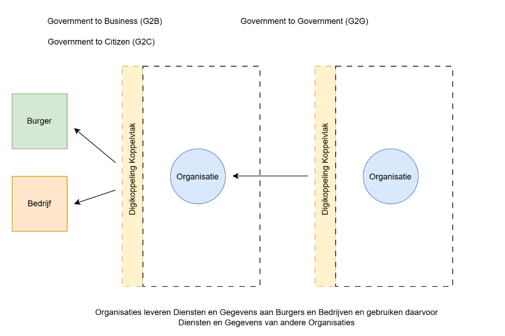
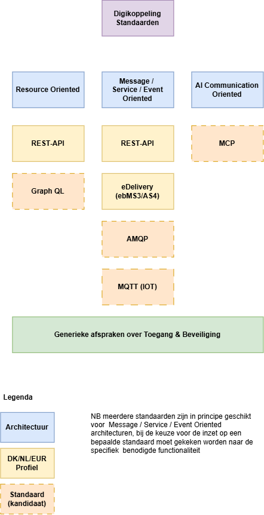
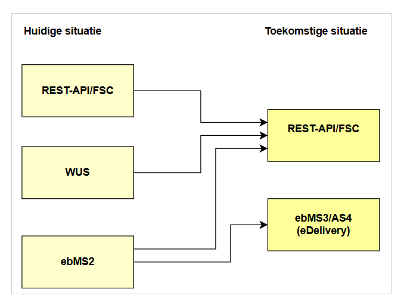
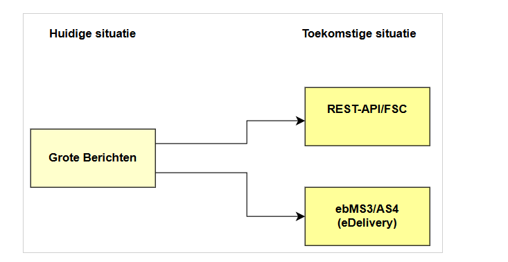

 ­­­­

# Toekomstbeeld Digikoppeling

Auteur: Peter Haasnoot

Versie: 16-09-26 

> In dit document wordt een toekomstbeeld geschetst voor de Digikoppeling standaard, input hiervoor is de themamiddag Digikoppeling van 24/6 zie bijlage voor het verslag van de themamiddag ([20260624 Verslag themamiddag Toekomstvisie Digikoppeling](https://github.com/Logius-standaarden/Overleg/blob/main/Digikoppeling/2026-09-24/20260624_Themadag%20Digikoppeling_verslag.md)

> Uitgangspunt voor het toekomstbeeld is dat dit voldoende draagvlak moet hebben bij de betrokken partijen om tot besluitvorming te kunnen komen in het Technisch Overleg Digikoppeling  & MIDO;

1 Inhoudsopgave
===============

- [1 Inhoudsopgave](#1-inhoudsopgave)
- [2 Inleiding](#2-inleiding)
- [3 Huidige situatie (IST)](#3-huidige-situatie-ist)  
  * [3.1 Doel van Digikoppeling](#31-doel-van-digikoppeling)
  * [3.2 Toepassingsgebied op pas-toe-of-leg -uit -lijst Forum Standaardisatie](#32-toepassingsgebied-op-pas-toe-of-leg--uit--lijst-forum-standaardisatie)
- [4 Knelpunten/aandachtspunten in de huidige situatie](4-knelpuntenaandachtspunten-in-de-huidige-situatie)
   * [4.1 Algemeen](#41-algemeen)
   * [4.2 Themadag](#42-themadag)
- [5 Toekomstbeeld  (SOLL)](#5-toekomstbeeld--soll) 
  * [5.1 Doel](#51-doel)
  * [5.2 Scope](#52-scope)
  * [5.3 Positionering in de GDI](#53-positionering-in-de-gdi)
  * [5.4 Inhoud & Opbouw van de standaard](#54-inhoud--opbouw-van-de-standaard)
    + [5.4.1 Inleiding](#541-inleiding)
    + [5.4.2 Standaarden](#542-standaarden)
  * [5.5 Algemeen life cycle afwegingskader](#55-algemeen-life-cycle-afwegingskader)
    + [5.5.1 Uitfasering](#551-uitfasering)
    + [5.5.2 Toevoegen van nieuwe standaarden](#552-toevoegen-van-nieuwe-standaarden)
  * [5.6 Governance op standaarden en profielen onder Digikoppeling](#56-governance-op-standaarden-en-profielen-onder-digikoppeling)
    + [5.6.1 Uitgangspunten](#561-uitgangspunten)
    + [5.6.2 Afspraken](#562-afspraken)
- [6 Transitiepad](#6-transitiepad)
  * [6.1 Life cycle management op huidige koppelvlak standaarden](#61-life-cycle-management-op-huidige-koppelvlak-standaarden)
  * [6.2 Transitie van Koppelvlakstandaarden](#62-transitie-van-koppelvlakstandaarden)
    + [6.2.1 Koppelvlakstandaarden](#621-koppelvlakstandaarden)
    + [6.2.2 Grote Berichten standaard](#622-grote-berichten-standaard)
  * [6.3 Planning & Aanpak eDelivery (ebMS3/AS4) toevoegen aan de standaard](#63-planning--aanpak-edelivery-ebms3as4-toevoegen-aan-de-standaard) 
    + [6.3.1 Plateau 0](#631-plateau-0)
    + [6.3.2 Plateau 1](#632-plateau-1)
    + [6.3.3 Plateau 2](#633-plateau-2)
    + [6.3.4 Plateau 3](#634-plateau-3)

2 Inleiding
===========

Voor de Digikoppeling standaard en het onderwerp standaarden voor gegevensuitwisseling in de GDI Architectuur speelt al enige tijd de wens om te komen tot een toekomstvisie voor gegevensuitwisseling standaarden en tot life cycle management op de Digikoppeling koppelvlakstandaarden . In deze notitie wordt de toekomstvisie uitgewerkt en de huidige situatie, toekomstige situatie en het transitiepad aangegeven;

3 Huidige situatie (IST)
========================

3.1 Doel van Digikoppeling
--------------------------

(Overheids)organisaties willen diensten klantgericht, efficiënt, flexibel en rechtmatig aanbieden aan burgers en bedrijven. Daarvoor moeten zij gegevens en documenten op een generieke manier met elkaar kunnen uitwisselen. Ook moeten overheden in staat zijn direct elkaars data bij de bron te bevragen. Met name wanneer deze data nodig is bij het uitvoeren van hun taken.

Digikoppeling voorziet hierin door de standaarden voor deze uitwisseling te definiëren. Met deze logistieke standaardisatie bevordert Digikoppeling de interoperabiliteit tussen (overheids)organisaties.

Digikoppeling kent de volgende koppelvlakstandaarden:

-   REST-API
-   ebMS2
-   WUS
-   Grote Berichten

3.2 Toepassingsgebied op pas-toe-of-leg -uit -lijst Forum Standaardisatie
-------------------------------------------------------------------------

Digikoppeling moet worden toegepast bij digitale gegevensuitwisseling die plaatsvindt met voorzieningen die onderdeel zijn van de GDI, waaronder de basisregistraties, of die sectoroverstijgend is. De verplichting geldt voor gegevensuitwisseling tussen systemen waarbij er noodzaak is voor tweezijdige authenticatie.

Geautomatiseerde gegevensuitwisseling tussen informatiesystemen op basis van NEN3610 is uitgesloten van het functioneel toepassingsgebied.

4 Knelpunten/aandachtspunten in de huidige situatie
===================================================

4.1 Algemeen
------------

Verouderde koppelvlakken moeten worden uitgefaseerd en vervanging hiervoor moet worden ingevoerd daarbij moet overlap in functionaliteit zoveel mogelijk worden voorkomen.

-   WUS en ebMS2  worden niet meer doorontwikkeld en kennen een teruglopende ondersteuning vanuit leveranciers en ontwikkelplaforms
-   WUS en REST-API kennen overlap wat betreft functionaliteit en toepassing (bevragingen/synchrone transacties),  REST-API kan gezien worden als vervanger van de WUS standaard

4.2 Themadag 
-------------

BIj de Themadag bleek met name draagvlak voor:

-   Invoeren van ebMS3/AS4 (eDelivery) 
-   Faciliteren van verschillende standaarden voor gegevensuitwisseling als dat voordelen heeft voor bepaalde toepassingen, architecturen en use cases.
-   Innovatie en gebruik nieuwe standaarden mogelijk maken
-   Afspraken maken rond Lifecycle management (Toevoegen en verwijderen van standaarden)
-   Niet alleen Overheid - Overheid gegevensuitwisseling ondersteunen maar ook Overheid naar Bedrijfsleven
-   Digikoppeling als "gereedschapskist" met geschikte standaarden voor verschillende architecturen en soorten gegevensuitwisseling

5 Toekomstbeeld  (SOLL)
=======================

In dit hoofstuk wordt het toekomstbeeld Digikoppeling geschetst op basis van de eerdere geconstateerde aandachtspunten, de visie vanuit het Technisch Overleg Digikoppeling en de inzichten van de Themadag Digikoppeling Toekomstvisie .  

5.1 Doel
--------

Digikoppeling biedt standaarden voor veilige en betrouwbare gegevensuitwisseling tussen systemen ten behoeve van overheidsdienstverlening;   Door Digikoppeling kunnen overheidsorganisaties eenvoudiger, veiliger, sneller en goedkoper gegevens uitwisselen dan wanneer alle organisaties  bilateraal afspraken zouden maken. De Digikoppeling standaard zorgt voor interoperabiliteit tussen systemen en maakt het mogelijk om gegevensuitwisseling efficiënt uit te voeren.

5.2 Scope
---------

De Digikoppeling standaard richt zich op een uniforme manier van system2system gegevensuitwisseling tussen overheden (G2G) en tussen overheden en private partijen (G2B). Digikoppeling biedt daarbij ondersteuning voor zowel gesloten diensten als open diensten;

### Overheid naar Overheid / Overheid naar Bedrijven

Door gebruik van standaarden worden gegevens op een uniforme manier uitgewisseld en ervaren bedrijven en overheden een gelijk mechanisme bij het maken van koppelingen met de verschillende overheidsdiensten.

### Open Diensten en Gesloten Diensten
Digikoppeling biedt ondersteuning voor zowel gesloten diensten als open diensten.

|Type | Open Dienst | Gesloten Dienst|
|---|---|---|
|G2G | (G2G) Koppelvlakstandaarden   zonder beveiligingsvoorschriften | (G2G) Koppelvlakstandaarden   met beveiligingsvoorschriften |
|G2B | (G2B) Koppelvlakstandaarden   zonder beveiligingsvoorschriften | (G2B) Koppelvlakstandaarden   met  beveiligingsvoorschriften |

5.3 Positionering in de GDI
---------------------------

Digikoppeling is het GDI bouwblok voor standaarden voor Gegevensuitwisseling en is gericht op de transport afspraken en de specificatie van koppelvlakken/interfaces van systemen;\
Digikoppeling is opgenomen op de pas toe of leg uit lijst van het Forum Standaardisatie dit heeft als voordeel dat de onderliggende koppelvlakstandaarden niet los met hetzelfde toepassingsgebied op de pas toe of leg uit lijst staan maar in samenhang kunnen worden aangeboden en onderhouden (life-cycle-management) met daarbij ook een afwegingskader/advies over gebruik en toepassing.

5.4 Inhoud & Opbouw van de standaard
------------------------------------

### 5.4.1 Inleiding

Doel van Digikoppeling is geschikte standaarden aan te bieden voor de verschillende soorten gegevensuitwisseling die in de praktijk voorkomen. Hierbij is het wenselijk om te sturen op standaarden en functionele overlap te beperken.

Digikoppeling vormt een gereedschapkist van standaarden waarbij standaarden worden opgenomen die voor een bepaalde toepassing en architectuur het meest geschikt zijn.

Om innovatie mogelijk te maken en legacy te voorkomen is actief life-cycle management op de set toegestane standaarden nodig.

### 5.4.2 Standaarden

De volgende architecturen worden ondersteund:

-   Resource Oriented Architecture
-   Message Oriented Architecture
-   Service Oriented Architecture
-   Event Oriented Architecture
-   AI Model Communication Architecture

Per architectuur worden hieronder de standaarden  weergegeven die zijn opgenomen in Digikoppeling:

-   Resource Oriented Architecture
    - REST-API profiel
    - *GraphQL*

-   Message Oriented Architecture
    -   eDelivery (ebMS3/AS4) profiel
    -   *AMQP (Advanced Message Queuing Protocol)*
    -   *MQTT (Message Queuing Telemetry Transport) (IOT)*

-   Service Oriented Architecture
    -   eDelivery (ebMS3/AS4) profiel
    -   *AMQP (Advanced Message Queuing Protocol)*
    -   *MQTT (Message Queuing Telemetry Transport) (IOT)*

-   Event Oriented Architecture
    -   eDelivery (ebMS3/AS4) profiel
    -   *AMQP (Advanced Message Queuing Protocol)*  
    -   *MQTT (Message Queuing Telemetry Transport) (IOT) *

-   AI Model Communication Architecture
    -   *MCP (Model Context Protocol) profiel*

*Schuingedrukt = voorbeelden van mogelijke toekomstige kandidaat onderdelen, dit betekent dat volgens het architectuur en life cycle afwegingskader besloten wordt of een bepaalde standaard wel of niet wordt opgenomen in Digikoppeling;*

| Standaard | Resource Oriented | Message Oriented | Service Oriented | Event Oriented | AI Model Communication Oriented |
| --- | --- | --- | --- | --- | --- |
| REST-API profiel | V | v | v | v |  |
| GraphQL | V |  |  |  |  |
| eDelivery (ebMS3/AS4) l |  | V | V | V |  |
| AMQP (Advanced Message Queuing Protocol) |  | V | V | V |  |
| MQTT (Message Queuing Telemetry Transport) (IOT) |  | V | V | V |  |
| MCP (Model Context Protocol) |  |  |  |  | V |

*V : de standaard biedt specifieke functionaliteit voor deze architectuur\
v:  de standaard biedt voor bepaalde use cases mogelijk voldoende functionalteit*

Let op!, De standaard is met V opgenomen in de digikoppeling 'toolbox' omdat deze specifieke functionaliteiten biedt voor deze architectuur, het is mogelijk voor bepaalde usecases een andere standaard te gebruiken - ,maar het is verstandig om bij afwijkingen een zorgvuldige afweging te maken;

In onderstaande figuur wordt de relatie tussen standaarden en architectuur type weergegeven 

5.5 Algemeen life cycle afwegingskader
--------------------------------------

De volgende regels bepalen of een bepaalde standaard wordt opgenomen of uitgefaseerd binnen Digikoppeling:

### 5.5.1 Uitfasering

Een standaard wordt uit gefaseerd wanneer 1 of meer van de onderstaande punten gelden 

-   De standaard niet meer onderhouden of doorontwikkeld wordt
-   Ondersteuning door leveranciers en ontwikkel platforms terugloopt
-   Kennis onvoldoende beschikbaar is in de markt

(In de governance wordt de afweging gemaakt of er doorslaggevende redenen zijn om een standaard uit te faseren)

### 5.5.2 Toevoegen van nieuwe standaarden

Een standaard wordt toegevoegd wanneer :

-   De standaard wordt gezien als opvolger van een uit te faseren standaard\
    (en/of)
-   De standaard biedt functionaliteit die meerwaarde biedt tov de reeds aanwezige standaarden voor bepaalde architecturen en use-cases daarbinnen

Algemene eisen hierbij in de beoordeling:

-   De standaard wordt voldoende ondersteund door leveranciers
-   Er is voldoende vraag en verwacht gebruik van de standaard
-   De standaard wordt beheerd als een open standaard

(In de governance wordt de afweging gemaakt of er doorslaggevende redenen zijn om een standaard toe te voegen)

5.6 Governance op standaarden en profielen onder Digikoppeling
--------------------------------------------------------------

### 5.6.1 Uitgangspunten

-   Digikoppeling is het GDI bouwblok dat aangeeft welke standaarden voor welke architectuur te gerbuiken zijn;
-   Digikoppeling levert voor standaarden NLgov profielen in geval aanvullende afspraken op de (internationale) standaard nodig zijn
-   Digikoppeling verwijst alleen naar de internationale standaard in het geval dat dit volstaat (of wanneer een profiel nog in ontwikkeling is)
-   Digikoppeling biedt algemene beveiligingsvoorschriften voor de verschillende koppelvlakstandaarden (zodat deze niet in aparte profielen hoeven te worden bijgehouden)

### 5.6.2 Afspraken

Per standaard wordt bijgehouden of dit een profiel of internationale standaard is en of deze de status "in gebruik" of "uit te faseren"" heeft 

| Koppelvlakstandaard | Type | Status |
| --- | --- | --- |
| REST-API profiel | Profiel | In Gebruik |
| eDelivery (ebMS3/AS4) l | Profiel | In Gebruik |
| GraphQL | Profiel | In Onderzoek |
| AMQP (Advanced Message Queuing Protocol) | Int. Std | In Onderzoek |
| MQTT (Message Queuing Telemetry Transport) (IOT) | Int. Std | In Onderzoek |
| MCP (Model Context Protocol) | Int. Std | In Onderzoek |
| ebMS2 | Profiel | Uit te faseren |
| WUS | Profiel | Uit te faseren ||

Aanpassingen op de status en invoering van nieuwe standaarden verloopt via Technisch overleg Digikoppeling, en MIDO governance conform het Digikoppeling Beheermodel

6 Transitiepad 
===============

6.1 Life cycle management op huidige koppelvlak standaarden
-----------------------------------------------------------

Op dit moment  zijn WUS en ebMS2 profielen onderdeel van de standaard, de onderliggende standaarden worden niet meer doorontwikkeld en kennen een teruglopende ondersteuning bij leveranciers.

De uitfaseringsplanning is als volgt (voorbeeld):

| Koppelvlak Standaard | Status | Toelichting | Einde Ondersteuning | Einde Gebruik |
| --- | --- | --- | --- | --- |
| Digikoppeling WUS | Uit te faseren | Het DK WUS koppelvlak dient te worden uit gefaseerd | bv 01-01-2029 | bv 01-01-2034 |
| Digikoppeling ebMS2 | Uit te faseren | Het DK ebMS2 koppelvlak dient te worden uit gefaseerd | bv 01-01-2029 | bv 01-01-2036 |

(NB Datums zijn nog nader te bepalen)

Na einde ondersteuning is gebruik nog toegestaan voor legacy applicaties tot datum einde gebruik. De organisatie is zelf verantwoordelijk voor functionele en security updates.

6.2 Transitie van Koppelvlakstandaarden
---------------------------------------

In onderstaande figuur wordt aangegeven welke overgangen mogelijk zijn:

### 6.2.1 Koppelvlakstandaarden

Toelichting:

-   Bij uitfasering van  de ebMS2 standaard kan voor specifieke use cases overgegaan worden op REST-API/FSC

### 6.2.2 Grote Berichten standaard

Toelichting:

-   Bij uitfasering van de Grote Berichten standaard kan gebruik gemaakt worden van de functionaliteit voor grote bestanden in ebms3/AS4 en REST-API

6.3 Planning & Aanpak eDelivery (ebMS3/AS4) toevoegen aan de standaard
----------------------------------------------------------------------

### 6.3.1 Plateau 0

-   Akkoord op toekomstvisie
-   Akkoord op algemene Life cycle management aanpak

(akkoord via TO, MIDO PT GU en PR)

### 6.3.2 Plateau 1

-   eDelivery ebMS3AS4  toegevoegd aan de standaard  (Doel : ervaring opdoen met overgang ebMS2 naar ebMS3)
-   Digikoppeling architectuur document aangepast conform toekomst visie

### 6.3.3 Plateau 2

-   SMP/SML directory  beschikbaar als centrale voorziening voor ebMS3/AS4

### 6.3.4 Plateau 3

-   Akkoord op Life cycle management ebMS2 & WUS (afspraken over  datum einde gebruik)
