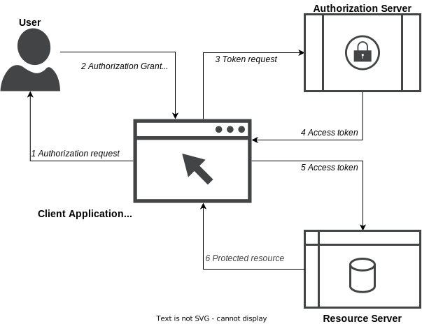
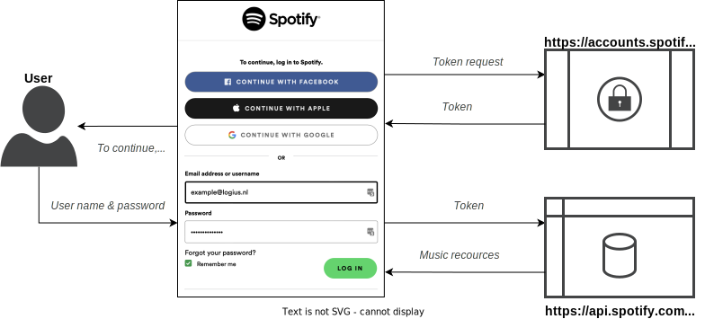
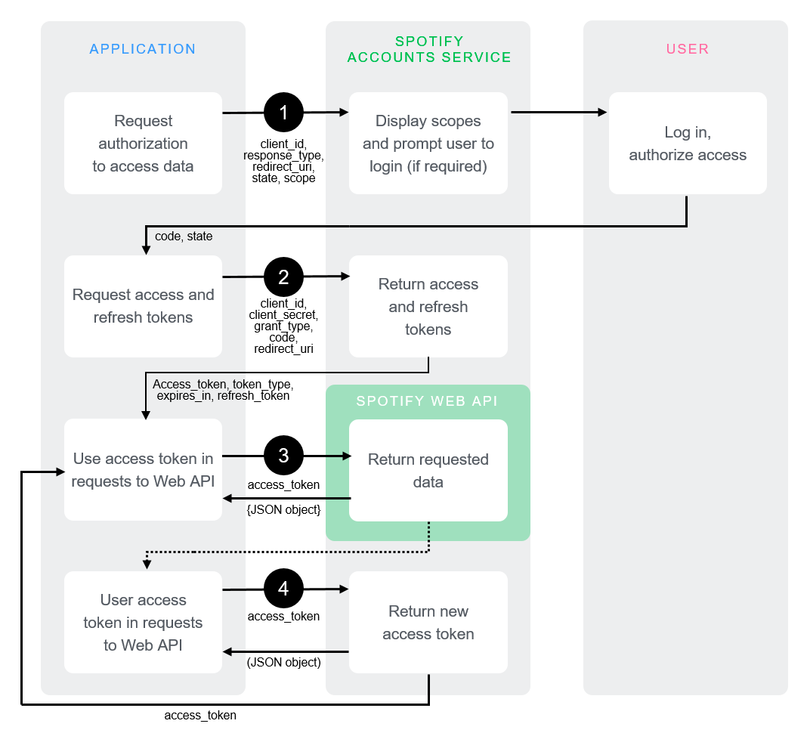

# OAuth - De basis

## Inleiding

Onlangs kregen we de vraag of er meer basisinformatie is over OAuth 2.0. Een heel begrijpelijke vraag. De huidige standaard die door het forum standaardisatie op de lijst van verplichte standaarden is gezet vereist namelijk deze basiskennis om te begrijpen wat de standaard nu eigenlijk verlicht stelt.

Een deel van het antwoord zit m al in de formele naamgeving van de standaard. Het betreft namelijk een profiel ofwel een vastgestelde configuratieflow voor de Nederlandse overheden op de formele OAuth 2.0 standaard.

## Context

OAuth 2.0 is een authorizatie framework wat het mogelijk maakt om gecontroleerde toegang te krijgen tot gebruikers accounts op een http service zoals bijvoorbeeld google, facebook, Spotify etc... De standaard werkt op basis van het delegeren van de user authentication aan de service die het user account host en door applicaties van derden te authoriseren om het user account te hergebruiken. Deze interactie wordt altijd beschreven in een flow. Het nederlandse profiel beschrijft alle aspecten van de door ons gewenste flow(s). Momenteel is alleen de Authorization Code Flow onderdeel van het Nederlandse profiel. Later meer hierover. Een aantal aspecten zijn wel essentieel en dus ook randvoorwaardelijk voor een gebruikelijke autorisatie op basis van OAuth2.0:

1. een <u>*user*</u> met een <u>*account*</u> : bijvoorbeeld example@logius.nl
2. een <u>*authorization service*</u> : waar de user zich kan identificeren en authenticeren : bijvoorbeeld Facebook/Apple/Google
3. een <u>*resource service*</u> : waar de inhoudelijke vraag aan wordt gesteld en waar de data/resources zijn opgeslagen : bijvoorbeeld Spotify
4. een <u>*client applicatie*</u> : waarmee de user z'n account gegevens invult en de vraag stelt aan de authorization service en de resource service : bijvoorbeeld de Spotify app of een testtool als Postman.

### In onderstaand schema zijn de vier bovenstaande elementen en de onderlinge flow weergegeven:

###  De flow is dan als volgt:

1. De **<u>user</u>** navigeert naar de client application of webbrowser (***<u>de client</u>***) en wordt gevraagd in te loggen (het *<u>authorization request</u>*). 
2. De <u>**user**</u> voert z'n account gegevens in die alleen hij weet (het *<u>client secret</u>*). Uiteraard doet de user dit alleen als hij de client applicatie vertrouwd.
3. De <u>**client**</u> stuurt op basis van de gegevens van de <u>**user**</u> een verzoek aan de <u>***authorization server***</u> (het <u>*token request*</u>). De **<u>authorization server</u>** beoordeeld dit verzoek op basis van alle beschikbare **<u>user</u>** en **<u>client</u>** gegevens. (Veelal dient een client applicatie zich vooraf eerst te registreren.)
4. De <u>**authorization server**</u> stuurt als alles goed is een *<u>Access token</u>* terug aan de **<u>client</u>**. Dit is gebruikelijk een JWT token.
5. De **<u>client</u>** stuurt namens de **<u>user</u>** een request aan de resource server en voorziet dit request van het <u>*access token*</u>. De resource server kan de combinatie van het request en de en token beoordelen en bepalen welk response aan de client wordt gestuurd.
6. Indien alles aan de vereisten voldoet stuurt de **<u>resource server</u>** een response aan de **<u>client</u>** met de gevraagde data (de <u>*protected resource*</u>)

## Voorbeeld

Zoals al aangegeven in de context werkt een voorbeeld het beste. In onderstaand schema is het voorbeeld opgenomen van Spotify waarbij een user, in dit geval example@logius.nl, inlogt op de Spotify webclient. Het voorbeeld gebruikt de authorization server van Spotify zelf om een token te verkrijgen en daarna kan de user zn persoonlijke gegevens, afspeellijsten en muziek opvragen bij de spotify API.

Zowel de webclient van Spotify als de client applicatie of app gebruiken dezelfde API om resources op te vragen. De "Coursera basis training met Postman" die in de [referenties](#Referenties) wordt genoemd legt uit hoe je deze flow kan naspelen met als client de testtooling van Postman. De Coursera training is met name interessant om verdere kennis op te doen. De training is gebaseerd op postman als client en gebruikt spotiy als server om tegen aan te praten. Hiervoor log je in op https://developer.spotify.com/ en maak je een App aan in het dashboard. In het voorbeeld is Spotify zowel de Authorization Server als de Resource server. Spofify beschrijft in het voorbeeld en de documentatie helder hoe de Authorization Code Flow precies werkt (zie https://developer.spotify.com/documentation/general/guides/authorization/code-flow/) en dit is ook precies de flow die in het NL Porfiel wordt gebruikt. Het gedetailleerde schema wat Spotify gebruikt om de flow toe te lichten is als volgt:

## Architectuur

De kern van OAuth is uiteraard het scheiden van de Authorization Server van de Resource Server en deze onafhankelijk te maken van de gebruikte client. Dit blijkt mooi uit bovenstaande flow en voorbeeld. Belangrijkste implicatie voor de architectuur is daarmee dan ook dat voor een dergelijke oplossing waarbij OAuth wordt toegepast de user niet alleen een client en een resource server wordt aangeboden maar ook een authorization server (drie autonome archhitectual building blocks). Dit kan een authorization server zijn van de organisatie zelf, zoals in het voorbeeld, maar ook een authorization server van een derde partij zoals in de context al wordt gesuggereerd en zoals je kan zien in het inlog scherm van Spotify waarbij je ook kan registreren met Facebook, Apple of Google. In de context van de Nederlandse overheids architectuur is het dus van belang bij een solution architectuur voor een voorziening goed na te gaan en documenteren welke partijen voorzien in de genoemde building blocks. zie ook het theme IAM en API van de Nora en uiteraard de genoemde standaarden zoals gepubliceerd door Logius en het Forum Standaardisatie.

## Referenties

[Coursera basis training met Postman]

https://www.coursera.org/projects/api-testing-a-real-application-via-postman

[Link naar de lijst van verplichte standaarden]

https://forumstandaardisatie.nl/open-standaarden/verplicht

[link naar de standaard]

[https://forumstandaardisatie.nl/open-standaarden/verplicht#:~:text=NL%20GOV%20Assurance%20profile%20for%20OAuth%202.0](https://forumstandaardisatie.nl/open-standaarden/verplicht#:~:text=NL GOV Assurance profile for OAuth 2.0)

[link naar de logius standaard]

https://publicatie.centrumvoorstandaarden.nl/api/oauth/

[link naar het IAM thema van de NORA]

https://www.noraonline.nl/wiki/Identity_%26_Access_Management_(IAM)

[link naar het API Thema van de NORA]

https://www.noraonline.nl/wiki/API

[Het JWT token kan  men eenvoudig decoden/inspecteren op]

http://jwt.io

