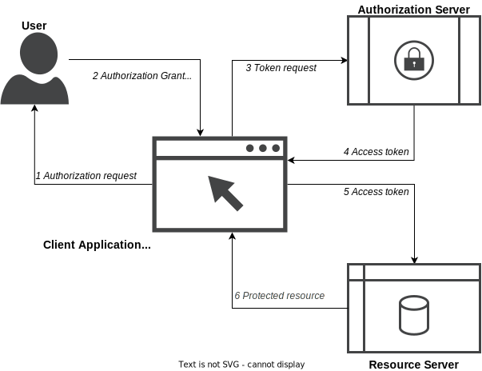

# OAuth - Samenvatting van de OAuth-NL standaard

> link naar de standaard: https://publicatie.centrumvoorstandaarden.nl/api/oauth/v1.0
> Versie 1.0 vastgesteld op 09 juli 2020

## Inleiding

Deze standaard is voor het ontsluiten van services van publieke/overheidsorganisaties. De services ontsluiten data via een zogenaamde Resource Server (verder aangeduid als de API). De resource server ofwel de API is afhankelijk van een Authorization Server. Deze Authorization Server voorziet in de identificatie en autorisatie van de user die de API bevraagd. De user gebruikt een Client die hij dient te vertrouwen om namens hem de vraag naar de API te sturen en de response op de vraag te ontvangen en presenteren.

### Schematische weergave van de flow van de standaard

## Vereisten

De standaard biedt simpel gezegd access control voor RESTful API's. Dergelijke API's worden momenteel door de overheid ontwikkeld conform de API Design Rules (ADR) en beschreven conform de Open API Specification (OAS). 

Deze standaard beschrijft vereisten voor de API (Resource Server), Authorization Server en de Client. Hieronder is een samenvatting van de vereisten toegelicht:

### 1. Introductie

- Iedere Authorization Server moet voldoen aan alle vereisten uit de standaard ([§  1.3](https://publicatie.centrumvoorstandaarden.nl/api/oauth/v1.0/#conformance))
- Iedere Client moet alle functies uit de standaard gebruiken ([§  1.3](https://publicatie.centrumvoorstandaarden.nl/api/oauth/v1.0/#conformance))
- Iedere API moet alle functies uit de standaard gebruiken ([§  1.3](https://publicatie.centrumvoorstandaarden.nl/api/oauth/v1.0/#conformance))

### 2. Client profiel

- Clients zijn _Full_ clients, ofwel web applicaties die centraal draaien, of _Native_ clients, instanties van software die draaien op het device van de user, de zogenaamde apps. Beide client types hebben verschillende vereisten ([§  2.1](https://publicatie.centrumvoorstandaarden.nl/api/oauth/v1.0/#client-types))
- Clients moeten vooraf zijn geregistreerd bij de Authorization Server ([§  2.2](https://publicatie.centrumvoorstandaarden.nl/api/oauth/v1.0/#client-registration))
- Clients mogen geen gebruik maken van een redirect naar de localhost en mogen ook geen waardes doorsturen naar andere URI's ([§  2.2.1](https://publicatie.centrumvoorstandaarden.nl/api/oauth/v1.0/#redirect-uri))
- Clients moeten een willekeurige status parameter genereren en koppelen aan de client sessie om deze vervolgens mee te sturen naar de Authorization server en te verifiëren of deze ook correct in de response wordt meegegeven ([§  2.3](https://publicatie.centrumvoorstandaarden.nl/api/oauth/v1.0/#connection-to-the-authorization-server))
- Clients moeten de volledige redirect URI meesturen in het verzoek aan de Authorization server ([§  2.3](https://publicatie.centrumvoorstandaarden.nl/api/oauth/v1.0/#connection-to-the-authorization-server))
- De Authorization Server moet de redirect URI controleren ten opzichte van de URI die vooraf is geregistreerd door de Client ([§  2.3](https://publicatie.centrumvoorstandaarden.nl/api/oauth/v1.0/#connection-to-the-authorization-server))
- Native Clients moeten PCKE toepassen ([§  2.3](https://publicatie.centrumvoorstandaarden.nl/api/oauth/v1.0/#connection-to-the-authorization-server))
- Wanneer de API, Client en Authorisation Server niet onder verantwoordelijkheid vallen van één organisatie moeten PKIOverheid certificaten worden gebruikt (met OIN) ([§  2.3.4](https://publicatie.centrumvoorstandaarden.nl/api/oauth/v1.0/#client-keys))
- Clients moeten autorisatie requests over TLS sturen en moeten het certificaat van de API verifiëren ([§  2.4](https://publicatie.centrumvoorstandaarden.nl/api/oauth/v1.0/#connection-to-the-protected-resource))

### 3. Authorization Server profiel

- De Authorization Server moet alle communicatie versleutelen met TLS en voldoen aan alle security eisen ([§  3](https://publicatie.centrumvoorstandaarden.nl/api/oauth/v1.0/#authorization-server-profile))
- De Authorization Server moet dynamic client registration toestaan. De autorisatie server mag de Scopes beperken van dynamisch geregistreerde clients ([§  3.1.3](https://publicatie.centrumvoorstandaarden.nl/api/oauth/v1.0/#dynamic-registration))
- De Authorization Server moet de user laten weten welke Client is geregistreerd en welke access die Client vraagt ([§  3.1.4](https://publicatie.centrumvoorstandaarden.nl/api/oauth/v1.0/#dynamic-registration))
- De Authorization Server moet OpenID.Discovery aanbieden ([§  3.1.5](https://publicatie.centrumvoorstandaarden.nl/api/oauth/v1.0/#discovery))
- De Authorization Server moet op verzoek van de Client tokens intrekken ([§  3.1.6](https://publicatie.centrumvoorstandaarden.nl/api/oauth/v1.0/#revocation))
- De Authorization Server moet JWT tokens verstrekken die de API kan verifiëren ([§  3.2.1](https://publicatie.centrumvoorstandaarden.nl/api/oauth/v1.0/#jwt-bearer-tokens))
- De Authorization Server moet authenticatie vereisen voor de revocation en introspection endpoints ([§  3.2.2](https://publicatie.centrumvoorstandaarden.nl/api/oauth/v1.0/#introspection))
- Alle uitgegeven tokens mogen worden ingetrokken ([§  3.4](https://publicatie.centrumvoorstandaarden.nl/api/oauth/v1.0/#token-lifetimes))
- Access tokens hebben verschillende lifetimes ([§  3.4](https://publicatie.centrumvoorstandaarden.nl/api/oauth/v1.0/#token-lifetimes))
- De Authorization Server zou Scopes moeten definiëren en documenteren ([§  3.5](https://publicatie.centrumvoorstandaarden.nl/api/oauth/v1.0/#scopes))

### 4. Protected Resource (API) profiel

- De API geeft de Client toegang wanneer deze een geldig access token en de correcte Scope heeft. De API vertrouwd erop dat de Authorization Server de security en access control borgt ([§  4.1](https://publicatie.centrumvoorstandaarden.nl/api/oauth/v1.0/#protecting-resources))
- De API (met vertrouwelijke data) die een hoger vertrouwensniveau vereist van de eindgebruiker moet de data alleen beschikbaar stellen binnen een unieke Scope ([§  4.1](https://publicatie.centrumvoorstandaarden.nl/api/oauth/v1.0/#protecting-resources))
- De Client die vertrouwelijke data wil opvragen bij de API moet een hoger vertrouwensniveau Scope meegeven in het verzoek aan de Authorization Server ([§  4.1](https://publicatie.centrumvoorstandaarden.nl/api/oauth/v1.0/#protecting-resources))
- De Authorization Server moet de authenticatie van de eindgebruiker op het juiste vertrouwensniveau vaststellen ([§  4.1](https://publicatie.centrumvoorstandaarden.nl/api/oauth/v1.0/#protecting-resources))
- Een API moet Bearer tokens accepteren in de authorization header en mag deze ook accepteren als form parameter ([§  4.2](https://publicatie.centrumvoorstandaarden.nl/api/oauth/v1.0/#protecting-resources))
- Een API mag geen access tokens accepteren als query parameter ([§  4.2](https://publicatie.centrumvoorstandaarden.nl/api/oauth/v1.0/#protecting-resources))
- Een API moet documenteren welke scopes vereist zijn voor toegang tot vertrouwelijke data ([§  4.2](https://publicatie.centrumvoorstandaarden.nl/api/oauth/v1.0/#protecting-resources))
- Een API moet een access token verifiëren ([§  4.3](https://publicatie.centrumvoorstandaarden.nl/api/oauth/v1.0/#connections-with-authorization-servers))
- Een API moet limiteren welke Authorization Servers het vertrouwt ([§  4.3](https://publicatie.centrumvoorstandaarden.nl/api/oauth/v1.0/#connections-with-authorization-servers))

### 6. Security overwegingen

- Alle transacties moeten worden versleuteld met TLS en het is aanbevolen om hierbij de richtlijnen van het NCSC op te volgen ([§  6](https://publicatie.centrumvoorstandaarden.nl/api/oauth/v1.0/#security-considerations))

## !! Disclaimer

Deze samenvatting is een interpretatie van de standaard en is niet volledig in de opsomming of beschrijving van alle vereisten. Wanneer de standaard moet worden geïmplementeerd dient altijd de officiële en actuele  standaard te worden gebruikt zoals gepubliceerd door het Forum Standaardisatie op: https://forumstandaardisatie.nl/open-standaarden/nl-gov-assurance-profile-oauth-20.
