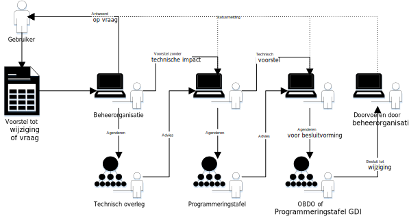

<!-----------------------------

   :warning: Dit bestand wordt automatisch gegenereerd.
   :warning: Handmatige toevoegingen worden overschreven.

----------------------------->
# Gegevensuitwisseling
## Onderwerpen

### Grote wijzigingen
* Digikoppeling-Koppelvlakstandaard-ebMS2 [issue #6] [Digikoppeling baseren op ebMS3](https://github.com/Logius-standaarden/Digikoppeling-Koppelvlakstandaard-ebMS2/issues/6) (3 februari 2022), _Status: In onderzoek_

### Overige punten
* API-Design-Rules [issue #228] [API Design Rules release 2.1 indienen bij MIDO](https://github.com/Logius-standaarden/API-Design-Rules/issues/228) (16 mei 2025)

## Toelichting

## Gebruiksaanwijzing

In het kader van de nieuwe governance willen we het proces van wijzigingsvoorstellen standaardiseren. We accepteren wijzigingsverzoeken als _issues_ via het beheerplatform wat we gebruiken [Github](https://www.github.com/). We labellen issues om scope, status en te agenderen overleg aan te geven. Bovenstaande lijst zijn issues gelabelled voor het de programmeringstafel Gegevensuitwisseling. De lijst wijzigngen voor dit overleg is automatisch gemaakt aan de hand van de labels.

We vragen de programmeringstafel Gegevensuitwisseling advies of goedkeuring op de wijzigingsvoorstellen afhankelijk van de status.

## Overgang van ebMS2 naar ebMS3, advies gevraagd

Vragen aan de leden van de programmeringstafel:
- Wat is de impact van een overgang van ebMS2 naar ebMS3 in Digikoppeling voor uw organisatie?
- Binnen welke termijn is overgang naar een nieuwe versie (met nieuwe software) mogelijk?
